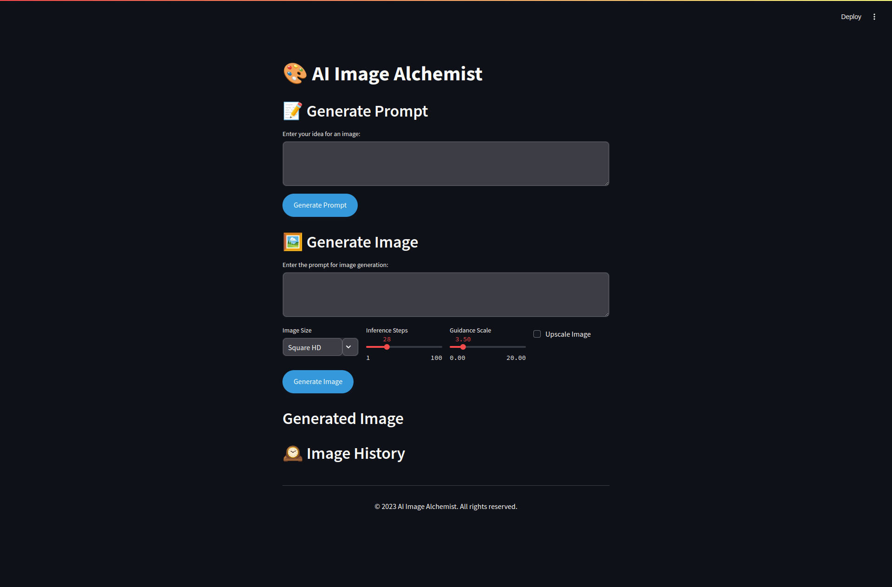

# AI Image Alchemist

AI Image Alchemist is a Streamlit-based web application that generates images based on text prompts using AI. It leverages advanced AI models to create unique images from user descriptions.



## Features

- Generate creative image prompts from user input
- Create AI-generated images based on prompts
- Upscale generated images for higher quality
- View and manage image generation history
- Download generated images

## Installation

1. Clone this repository:
   ```
   git clone https://github.com/yourusername/ai-image-alchemist.git
   cd ai-image-alchemist
   ```

2. Install the required dependencies:
   ```
   pip install -r requirements.txt
   ```

3. Set up your environment variables:
   - Create a `.env` file in the root directory
   - Add your API key: `API_KEY=your_api_key_here`

## Usage

1. Run the Streamlit app:
   ```
   streamlit run "imagen.py"
   ```

2. Open your web browser and go to the URL provided by Streamlit (usually `http://localhost:8501`)

3. Use the interface to generate prompts, create images, and manage your image history

4. If you encounter issues with prompt generation, you should change the system prompt in the `imagen.py` file.
## Project Structure

- `imagen.py`: Main Streamlit application
- `storage.py`: Handles image history storage and retrieval
- `requirements.txt`: List of Python dependencies
- `generated_images/`: Directory where generated images are saved
- `image_history.json`: JSON file storing the image generation history

## Dependencies

See `requirements.txt` for a full list of dependencies.

## Contributing

Contributions are welcome! Please feel free to submit a Pull Request.

## License

This project is licensed under the MIT License - see the [LICENSE](LICENSE) file for details.

## Acknowledgements

- [Streamlit](https://streamlit.io/) for the web application framework
- [OpenAI](https://openai.com/) for the GPT model used in prompt generation
- [AIML API](https://aimlapi.com/) for image generation capabilities

## Disclaimer

This project is for educational purposes only. Ensure you comply with all relevant laws and regulations when using AI-generated content.
